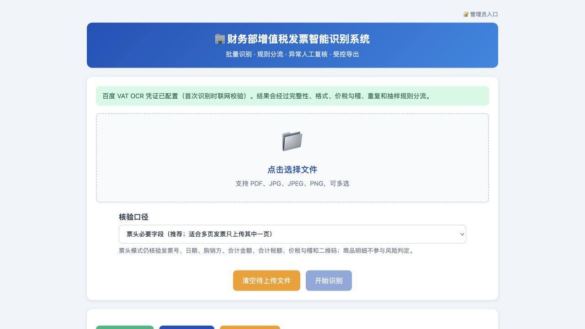
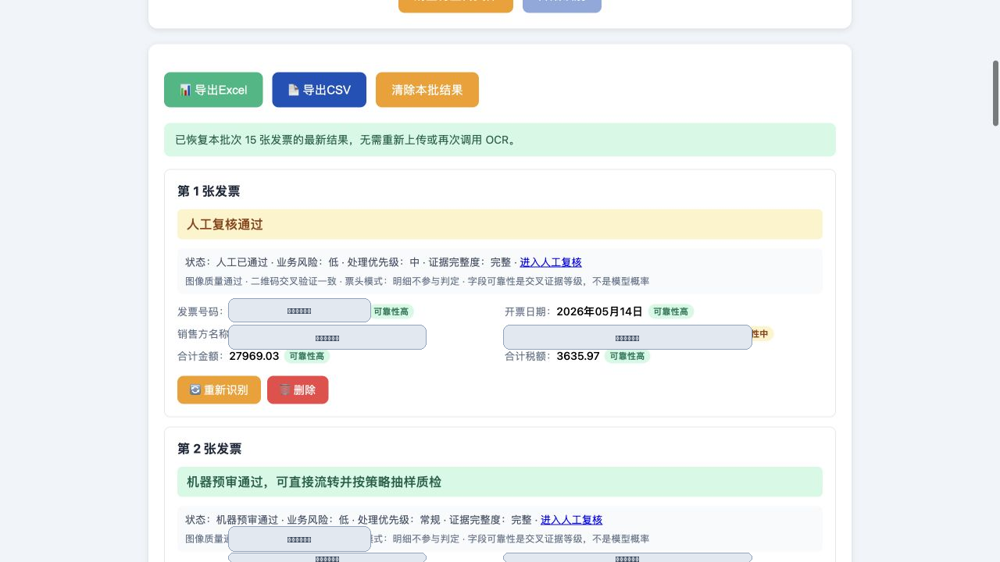
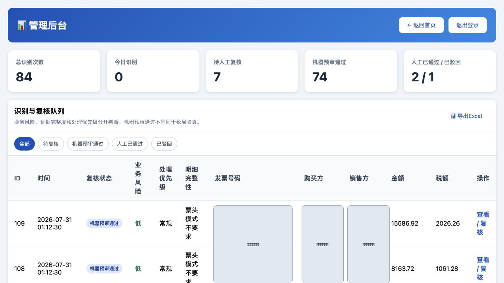
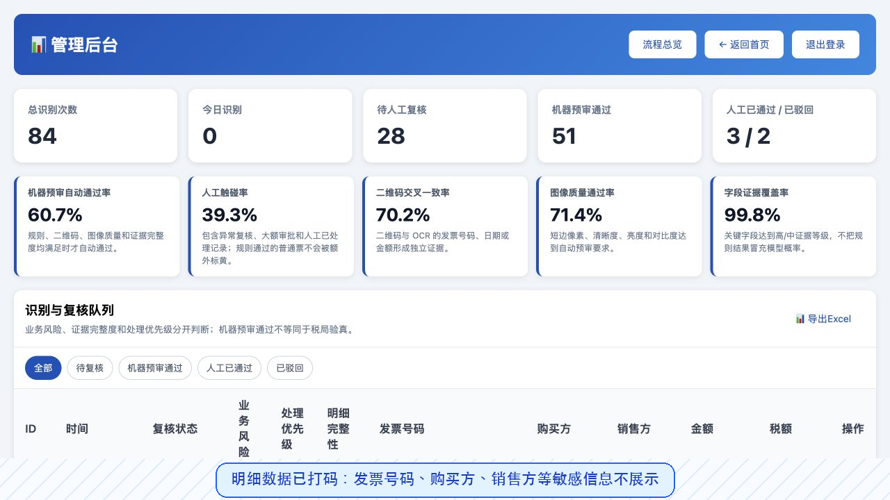
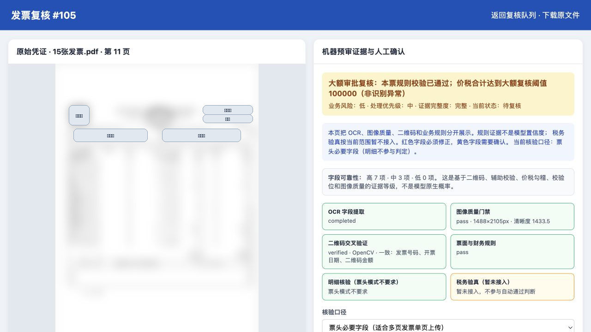

# finance-invoice-ocr｜增值税发票识别与台账系统

[](https://github.com/Elias-love/finance-invoice-ocr/actions/workflows/tests.yml)


> 上传增值税发票（PDF / 图片），自动 OCR 识别关键字段并录入台账，支持批量识别、后台管理与 Excel/CSV 导出。面向财务日常的发票数字化场景。

**本仓库的发票台账数据均为脚本生成的虚构数据（"星辰集团"体系），与任何真实企业无关；OCR 密钥、管理员密码等敏感信息均从环境变量读取，不入库。**

## 界面展示

以下截图用于 GitHub 公开展示，发票号码、公司名和原始票据中的二维码等可识别信息已打码。











## 功能

| 功能 | 说明 |
|------|------|
| 发票识别 | 上传增值税发票 PDF / 图片，调用百度云 VAT OCR 提取字段 |
| PDF 解析 | 默认约 180 DPI 渲染，限制页数与渲染像素，降低小数字丢笔画和 PDF 炸弹风险 |
| 图像质量门禁 | 识别前检查分辨率、模糊度、亮度和对比度，低质量票据不得自动通过 |
| 二维码交叉验证 | OpenCV + ZXing 双引擎，将号码、日期和金额与 OCR 独立核对；不冒充税务验真 |
| 字段提取 | 发票号码、日期、购销方名称/税号、金额、税额、税率、商品明细等 |
| 双核验口径 | 默认票头必要字段模式，支持多页发票只上传含票头的一页；需要商品明细时可切换完整明细核验 |
| 入账控制 | 必填字段、日期、信用代码校验位、票头/明细/税率/大写金额、购买方白名单与本批重复 |
| 机器预审分流 | 将业务风险、处理优先级、证据完整度和明细OCR完整性分开判断 |
| 字段可靠性 | 对关键字段输出高/中/低及证据依据；不把规则结果伪装成未经校准的百分比置信度 |
| 人工复核 | 当前单页并排展示、原值对比、规则证据分栏、快捷通过下一张和完整操作轨迹 |
| 批次恢复 | 进入复核页或刷新首页后，从数据库恢复本批识别结果；旧会话也能找回最近上传文件，不会重复调用 OCR |
| 台账录入 | 保留首轮 OCR、单页重识别尝试、人工修正版、文件 SHA-256 与控制证据 |
| 成本与失败控制 | 相同源文件复用 OCR 缓存；异常票可只重识别对应页，不重复处理整份 PDF |
| 后台管理 | 管理员登录后查看复核队列、按状态筛选、清空台账、导出全量历史 |
| 数据导出 | 台账一键导出 Excel / CSV |

## 架构

```
上传发票(PDF/图片)
      │  app.py（路由 + 上传大小/类型校验）
      ├─ PDF → PyMuPDF 逐页转图片
      ▼
invoice/ocr.py ──► 图像质量/二维码 ──► 百度 VAT OCR（token 缓存 + 明确错误处理）
      ▼
invoice/extract.py（字段抽取） ──► invoice/validate.py（票头/明细/大写/校验位）
      ▼
invoice/review.py（证据分级 + 大额/异常分流）
      ▼
invoice/storage.py（原始值/修正值分离 + 复核审计轨迹 + 原票授权预览）
      ▼
templates/ ──► 识别结果 / 复核队列 / 并排复核 / Excel·CSV
```

### 模块划分

```
├── app.py                    # 应用入口：路由、日志、上传校验、导出
├── config.py                 # 集中配置：环境变量 + 常量（字段定义单一来源）
├── invoice/
│   ├── ocr.py                # 百度 OCR、约180 DPI渲染、单页重试、付费调用控制
│   ├── evidence.py           # 图像质量门禁、二维码读取及 OCR 交叉验证
│   ├── storage.py            # SQLite 台账：线程安全，替代原 JSON 文件
│   ├── extract.py            # OCR 字段抽取
│   ├── validate.py           # 必填/格式/价税勾稽控制（不冒充税局真伪查验）
│   └── review.py             # 可解释证据分级、自动通过/异常/大额分流
├── templates/                # Jinja 模板（HTML 与 Python 解耦，自动转义防 XSS）
├── scripts/generate_mock_invoices.py   # 虚构发票数据生成器
└── tests/                    # 单元测试（pytest）
```

## 快速开始

```bash
pip install -r requirements.txt
cp .env.example .env                          # 填入百度 OCR 密钥与管理员密码
python scripts/generate_mock_invoices.py      # 生成虚构"星辰集团"发票台账（演示用）
python app.py                                 # 打开 http://127.0.0.1:5007
```

- 所有识别、导出和台账页面均须先通过 `/admin` 登录；`ADMIN_PASSWORD` 未设置时系统保持锁定
- 单来源 IP 默认每分钟最多处理 60 个 OCR 页，单个 PDF 默认最多 30 页
- 默认 `PDF_ZOOM=2.5`（约 180 DPI）；上线前应使用本单位样本重新标定图像质量阈值
- 百度 OCR 密钥申请：https://cloud.baidu.com/product/ocr/invoice （不配置则识别不可用，但可浏览演示台账）
- `access_token` 按百度返回的 `expires_in` 在内存缓存，提前 5 分钟自动刷新；若接口返回 token 过期/无效，自动刷新并重试一次
- `BAIDU_OCR_PROXY_MODE=auto` 会在系统代理无法连接百度 OCR 时自动直连兜底；也可设为 `direct` 或 `system`

### macOS 本机常驻启动

本地演示可使用 `deploy/macos/com.finance.invoice.ocr.plist` 注册 LaunchAgent，
登录后自动启动 `http://127.0.0.1:5007`，异常退出时自动拉起。启动脚本为
`scripts/start_local_server.sh`；实际安装时建议把包装脚本放到用户 Library 目录，
避免 macOS 后台服务直接执行 Desktop 路径时触发权限限制。

## 复核策略

标准 VAT OCR 接口返回结构化字段和部分辅助校验字段，但没有统一的字段级
`probability`。系统因此不展示虚构的“98% 置信度”，而使用可审计的证据等级：

- `高`：字段获得二维码、百度辅助校验、价税勾稽、金额大小写或信用代码
  校验位等独立/确定性证据支持
- `中`：字段已提取且未发现冲突，但主要依赖 OCR 单一来源，或原图质量存在警告
- `低`：字段缺失、格式/规则失败、二维码冲突或原图质量不合格

字段可靠性描述“当前证据对该字段的支持程度”，不等于模型原生概率，
也不等于发票真伪结论。

1. 默认使用 `票头必要字段` 口径：关键字段完整、格式正确、图像质量通过、
   二维码交叉一致、票头严格满足 `合计金额 + 合计税额 = 价税合计`、
   无重复、未达到大额阈值
   → `机器预审通过`
2. 多页发票只上传其中一页时，本页商品明细不与整票合计比较；页面仍保留
   明细提取结果，但不参与风险、证据完整度和自动通过判断
3. 用户主动选择 `完整明细核验` 后，才要求所提供页面覆盖完整商品明细；
   明细OCR汇总与票头不一致
   → `业务风险低、明细完整性异常、处理优先级中`
4. 缺字段、票头合计金额与合计税额不能严格加总为价税合计、二维码字段冲突、本次识别批内重复
   → `待人工复核（业务风险高）`
5. 二维码不可读
   → `二维码证据未取得`，不表示发票异常；使用 ZXing 做第二解码兜底
6. 达到 `HIGH_VALUE_REVIEW_AMOUNT`
   → 证据等级不降低，仅按审批策略提高处理优先级，并明确标注“非识别异常”

人工复核和单页重识别不会覆盖首轮 OCR JSON：候选值与每次尝试单独保存，并记录
操作者、时间、意见和批准/驳回动作。机器预审通过只代表本地控制通过，
二维码也不是税局验真；本项目按当前范围暂不接入税务验真。
明细漏行等机器硬异常允许复核人员在关键入账字段完整的前提下覆盖，但必须填写
复核依据；关键字段缺失或类型无效仍禁止批准。
待复核和已驳回记录无法通过导出接口绕过流程；若将
`ALLOW_AUTO_PASS_EXPORT=0`，则只有人工批准记录可以导出。

## 测试

```bash
python -m pytest tests/ -q
```

覆盖 token 缓存/自动刷新、双引擎二维码证据、图像质量、信用代码校验、明细与大写
金额勾稽、红字发票、OCR 缓存、单页重试、原值分离、鉴权和 CSRF。

## 生产部署

```bash
# waitress（跨平台）
waitress-serve --port=5007 --threads=16 app:app

# 或 gunicorn（Linux）
gunicorn -w 4 -b 0.0.0.0:5007 app:app
```

## 工程化要点

- **模块解耦**：OCR / 存储 / 抽取 / 路由 / 配置分离，HTML 移出 Python 进 Jinja 模板
- **SQLite 台账**：替代原 JSON 文件，独立连接 + 文件级锁，支持并发写入不丢数据
- **安全**：密钥全部环境变量化；识别/导出强制登录；付费 OCR 限流；文件扩展名与内容签名双校验；CSV/Excel 公式注入防护
- **可靠**：百度 token 带过期缓存；代理握手失败可直连兜底；同源文件复用缓存，失败页单独重试
- **财务控制闭环**：取消任何随机“真伪有效”结论；后端只给出可复核的格式/勾稽/重复控制，并明确标注“非税局真伪查验”
- **例外管理**：低风险记录机器预审通过，高风险和大额策略记录进入人工队列，避免所有发票重新人工录入
- **审计可追溯**：首轮识别值不可覆盖，重识别尝试、字段差异与批准/驳回轨迹单独留存
- **职责分离**：支持独立复核账号和可选的经办/复核分离；网页清空台账默认关闭
- **可测**：核心逻辑有单元测试与 CI

## 安全说明

- 百度密钥、管理员密码、Flask 会话密钥**全部从环境变量读取**，源码零硬编码
- `.env` 与 `data/`（SQLite 台账）均在 `.gitignore` 中，不会入库
- 发票图片会发送到百度云 OCR。真实部署前必须完成数据分级、供应商合规评估和用户授权；需要数据不出域时应替换为私有 OCR
- 演示数据为虚构；真实使用时台账即业务数据，请勿公开

## 评估边界

现有单元测试验证字段抽取、token 刷新、存储迁移、价税勾稽、重复检查、
复核状态流转和接口鉴权；它们不等于 OCR 准确率评估。生产试点前需建立人工
标注发票集，分别统计发票号码、税号、金额、税额、日期的字段级完全匹配率，
并记录自动通过率、人工触碰率、单张处理时间、接口成本和人工复核差错率。达到
目标前，`AUTO_PASS_ENABLED` 应设置为 `0`。

## 上线边界与下一阶段

当前开源版仍是单机 Flask + SQLite，适合本地演示和受控试点，不应直接作为多人
生产系统。正式上线还需把同步识别迁移到持久化任务队列，使用 PostgreSQL 与对象
存储，接入 SSO/MFA、密钥管理、恶意文件扫描、监控告警、备份恢复和不可篡改归档。
税务验真不在当前实施范围；历史重复入账控制应在 ERP/AP 入账环节独立保留。

## 说明

本项目为个人作品集的脱敏演示版。原始版本用于真实发票批量数字化，此处替换为虚构数据、抽离密钥、并做模块化与工程化改造后开源。

## License

MIT
